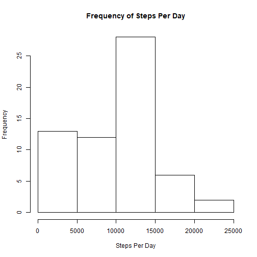
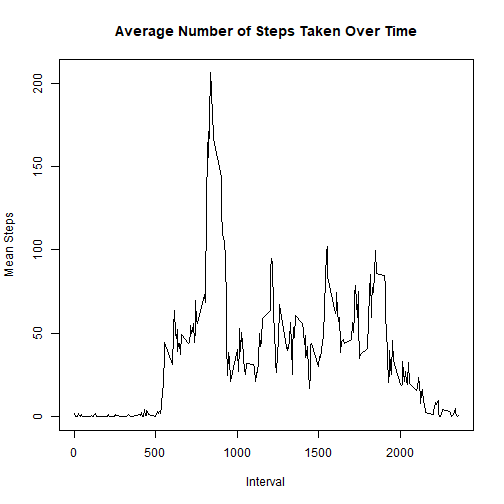
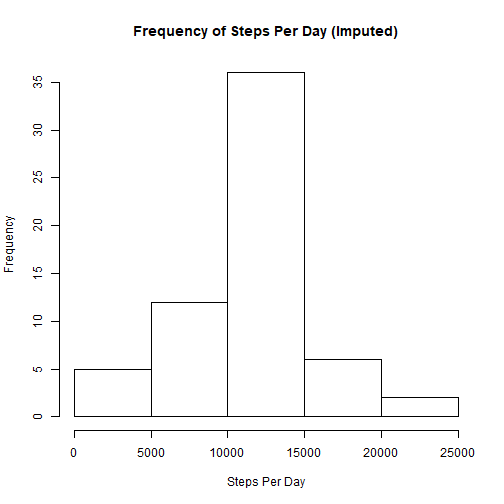
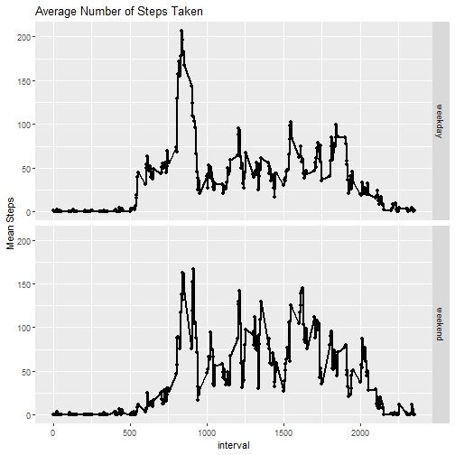

#load ggplot

```r
library(ggplot2)
```

```
## Warning: package 'ggplot2' was built under R version 3.5.3
```

#Read the data

```r
data <- read.csv("activity.csv")
```

#Calculate the total number of steps taken per day

```r
totalstepsperday <- tapply(data$steps, data$date, sum, na.rm=T)
```

#Make a histogram of the total number of steps taken each day

```r
hist(totalstepsperday, main = "Frequency of Steps Per Day", xlab= "Steps Per Day", ylab="Frequency")
```



#Calculate and report the mean and median of the total number of steps taken per day

```r
print(mean(totalstepsperday))
```

```
## [1] 9354.23
```

```r
print(median(totalstepsperday))
```

```
## [1] 10395
```

#Make a time series plot (type="l") of the 5-minute interval (x-axis) and the average number of steps taken, averaged across all days (y-axis)

```r
data1 <- data[!is.na(data$steps),]
meansteps <- tapply(data1$steps, data1$interval, mean)
interval <- levels(as.factor(data1$interval))
```

```r
plot(interval, meansteps, type = "l", main = "Average Number of Steps Taken Over Time", xlab = "Interval", ylab = "Mean Steps")
```



#Which 5-minute interval, on average across all the days in the dataset, contains the maximum number of steps?

```r
table <- data.frame(meansteps, interval)
table[table$meansteps==max(table$meansteps),][2]
```

```
##     interval
## 835      835
```

#Calculate and report the total number of missing values in the dataset (i.e. the total number of rows NAs)

```r
missingsteps <- data[is.na(data$steps),]
print(nrow(missingsteps))
```

```
## [1] 2304
```

#Devise a strategy for filling in all of the missing values in the dataset. Create a new dataset that is equal to the original dataset but with the missing data filled in.

```r
missingsteps$steps <- meansteps
imputeddata <- rbind(data1, missingsteps)
imputeddata <- imputeddata[order(imputeddata$date),]
```

#Make a histogram of the total number of steps taken each day and Calculate and report the mean and median total number of steps taken per day. Do these values differ from the estimates from the first part of the assignment? What is the impact of imputing missing data on the estimates of the total daily number of steps?

```r
totalstepsperdayimputed <- tapply(imputeddata$steps, imputeddata$date, sum)
```

```r
hist(totalstepsperdayimputed, main= "Frequency of Steps Per Day (Imputed)", xlab= "Steps Per Day", ylab="Frequency")
```



```r
print(mean(totalstepsperdayimputed))
```

```
## [1] 10766.19
```

```r
print(median(totalstepsperdayimputed))
```

```
## [1] 10766.19
```

```r
summary(totalstepsperday)
```

```
##    Min. 1st Qu.  Median    Mean 3rd Qu.    Max. 
##       0    6778   10395    9354   12811   21194
```

```r
summary(totalstepsperdayimputed)
```

```
##    Min. 1st Qu.  Median    Mean 3rd Qu.    Max. 
##      41    9819   10766   10766   12811   21194
```

#Create a new factor variable in the dataset with two levels - "weekday" and "weekend" indicating whether a given date is a weekday or weekend day

```r
imputeddata$day <- weekdays(as.Date(imputeddata$date))
weekend_feature <- grep("Saturday|Sunday", imputeddata$day, ignore.case = T)
weekenddata <- imputeddata[weekend_feature,]
weekenddata$weekday <- "weekend"
weekdaydata <- subset(imputeddata,imputeddata$day!=weekend_feature)
```

```
## Warning in imputeddata$day != weekend_feature: longer object length is not a multiple of shorter object length
```

```r
weekdaydata$weekday <- "weekday"
mergeddata <- rbind(weekdaydata, weekenddata)
```

#Make a panel plot containing a time series plot (type="l") of the 5-minute interval (x-axis) and the average number of steps taken, averaged across all weekday days or weekend days (y-axis)

```r
meansteps <- aggregate(steps~ interval+weekday, mergeddata, mean)
```

```r
graph <- qplot(interval, steps, data = meansteps, facets = weekday~.)
graph + geom_line(size = 0.75) + ylab("Mean Steps") + ggtitle("Average Number of Steps Taken")
```


